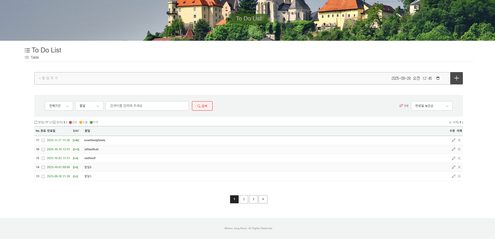
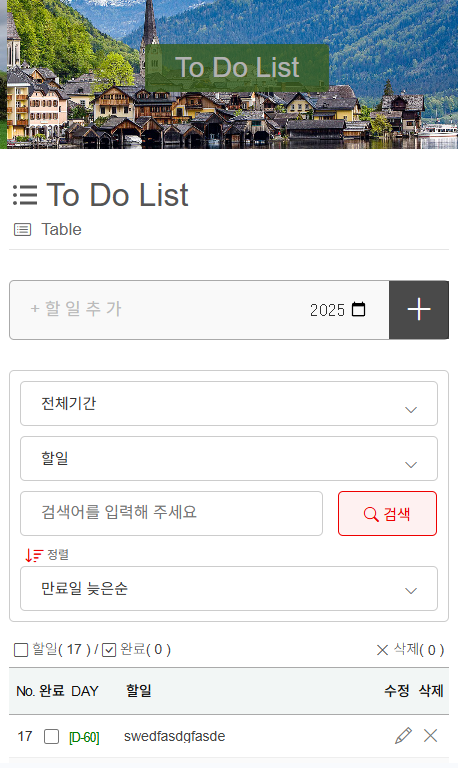

# 📌 Next.js ToDo List Project

[](https://creativecommons.org/licenses/by-nc/4.0/)


## 📖 소개
이 프로젝트는 **Next.js + TypeScript + SCSS + MongoDB** 기반으로 제작된 **풀스택 ToDo List 애플리케이션**입니다.  
RESTful API를 직접 구현하고, **컴포넌트 / 커스텀 컴포넌트 / 커스텀 훅** 구조로 관심사 분리를 실현했습니다.  
GitHub와 Vercel을 통한 **CI/CD 자동 배포**까지 적용했습니다.  

---

## 🚀 기술 스택
- **Frontend**: Next.js (App Router), TypeScript, SCSS  
- **Backend / API**: Next.js API Routes, MongoDB Atlas, Mongoose  
- **상태 관리 & 로직 분리**: Custom Hooks (입력, 필터/정렬, 카운트, 페이징, 모달 등)  
- **CI/CD & 배포**: GitHub, Vercel  

---

## ⚡ 주요 기능
- ✅ 할일 CRUD (등록, 수정, 삭제, 선택삭제, 복원, 완전삭제)  
- 📅 만료일 입력 & D-Day 카운트
- 🔍 필터1 : 전체기간, 오늘, 이번 주, 지난 주, 다음 주, 이번 달, 지난 달, 다음 달, 3개월 이내, 6개월 이내, 올해, 지난 해, 내년, 만료된 항목 / 초기화
- 🔍 필터2 : 할일, 만료된 항목, 완료된 항목, 삭제된 항목 / 초기화
- 🔍 정렬 : 최근 추가순, 오래된 추가순, 만료일 늦은순, 만료일 빠른순
- 📊 전체 / 완료 / 미완료 개수 집계  
- 🔄 페이지네이션 (그룹 단위)  
- ⚠️ Confirm Modal (삭제/수정 전 사용자 확인)  
- ☁️ MongoDB Atlas 연동 → 실시간 CRUD 반영  

---

## 🗂 폴더 구조
```
src/
 ┣ app/                  # Next.js App Router
 ┣ components/           # UI 컴포넌트
 ┃ ┗ todo/
 ┃    ┣ CountComponent.tsx
 ┃    ┣ FilterSortComponent.tsx
 ┃    ┣ InputComponent.tsx
 ┃    ┣ PaginationComponent.tsx
 ┃    ┣ SelectDeleteComponent.tsx
 ┃    ┣ TitleComponent.tsx
 ┃    ┣ TodoListComponent.tsx
 ┃    ┣ ConfirmModalComponent.tsx
 ┃    ┣ FooterComponent.tsx
 ┃    ┣ HeaderComponent.tsx
 ┃    ┗ MainComponent.tsx
 ┣ custom/               # 커스텀 훅 + 타입
 ┃ ┣ hooks/
 ┃ ┃ ┣ useConfirmModalComponent.ts
 ┃ ┃ ┣ useCountComponent.ts
 ┃ ┃ ┣ useFilterSortComponent.ts
 ┃ ┃ ┣ useInputComponent.ts
 ┃ ┃ ┣ usePaginationComponent.ts
 ┃ ┃ ┣ useSelectDeleteComponent.ts
 ┃ ┃ ┗ useTodoListComponent.ts
 ┃ ┣ types/todo.ts
 ┃ ┗ useCustom.ts
 ┣ lib/mongodb.ts        # DB 연결 유틸
 ┣ models/Todo.ts        # Mongoose Schema
 ┗ ...
```

---

## ✨ Features

### 1️⃣ 기본 컴포넌트 (Layout)
- **HeaderComponent.tsx** : 상단 헤더 (프로젝트 로고/메뉴 등)  
- **MainComponent.tsx** : TodoList 핵심 기능 집약  
- **FooterComponent.tsx** : 하단 푸터 (저작권/링크 등)  
- **ConfirmModalComponent.tsx** : 삭제/수정 전 사용자 확인 모달  

📸 *Screenshot Placeholder*  
> ⬇️ 예시: 헤더 + 메인 + 푸터 전체 화면  

---

### 2️⃣ 커스텀 컴포넌트 (MainComponent 하위)
- **TitleComponent.tsx** : TodoList 제목 및 부제 표시  
- **InputComponent.tsx** : 할일 입력 & 만료일 입력 UI  
- **FilterSortComponent.tsx** : 만료일 기준 필터 & 정렬 UI  
- **CountComponent.tsx** : 전체/완료/미완료 개수 집계  
- **TodoListComponent.tsx** : 할일 목록 렌더링 + 체크/수정/삭제  
- **SelectDeleteComponent.tsx** : 여러 항목 선택 후 일괄 삭제  
- **PaginationComponent.tsx** : 페이지네이션 (그룹 단위 이동)  

📸 *Screenshot Placeholder*  
> ⬇️ 예시: 할일 입력 → 목록 표시 → 필터 & 정렬 → 페이지네이션  

---

### 3️⃣ 커스텀 훅 (로직/상태 관리)
- **useCustom.ts** : Next.js `a` 태그 라우팅 전용 훅  
- **useInputComponent.ts** : 할일/만료일 입력 상태 관리  
- **useFilterSortComponent.ts** : 필터 & 정렬 상태 관리  
- **useCountComponent.ts** : 완료/미완료/전체 개수 집계  
- **useTodoListComponent.ts** : DB 연동 CRUD + 할일 목록 관리  
- **useSelectDeleteComponent.ts** : 선택 삭제 로직 관리  
- **usePaginationComponent.ts** : 페이지네이션 계산 로직  
- **useConfirmModalComponent.ts** : 모달 열림/닫힘/확인 상태 관리  

📸 *Screenshot Placeholder*  
> ⬇️ 예시: 모달 실행 장면, 선택삭제 동작, 필터/정렬 UI  

---

### 🔗 컴포넌트 ↔ 훅 매핑
| 컴포넌트 (UI) | 커스텀 훅 (Logic/State) | 설명 |
|---------------|-------------------------|------|
| InputComponent | useInputComponent | 할일/만료일 입력 |
| FilterSortComponent | useFilterSortComponent | 필터 & 정렬 |
| CountComponent | useCountComponent | 완료/미완료 집계 |
| TodoListComponent | useTodoListComponent | CRUD + 목록 관리 |
| SelectDeleteComponent | useSelectDeleteComponent | 다중 삭제 |
| PaginationComponent | usePaginationComponent | 페이지네이션 |
| ConfirmModalComponent | useConfirmModalComponent | 모달 상태 관리 |
| TitleComponent | - | 단순 UI |

---

## 🛠 설치 및 실행 방법

### 1️⃣ 저장소 클론
```bash
git clone https://github.com/moonjongjs/todolist_mdb_ts.git
cd todolist_mdb_ts
```

---

### 2️⃣ 의존성 설치

#### npm 사용 시
```bash
# 패키지 설치
npm install

# 실행 시 필요한 패키지
npm install axios bootstrap-icons date-fns mongodb mongoose next@13.5.11 react react-dom

# 개발 환경에서만 필요한 패키지
npm install -D @types/node @types/react @types/react-dom eslint eslint-config-next sass sass-loader typescript
```

#### yarn 사용 시
```bash
# 패키지 설치
yarn install

# 실행 시 필요한 패키지
yarn add axios bootstrap-icons date-fns mongodb mongoose next@13.5.11 react react-dom

# 개발 환경에서만 필요한 패키지
yarn add -D @types/node @types/react @types/react-dom eslint eslint-config-next sass sass-loader typescript
```

---

### 3️⃣ 환경 변수 설정
루트 경로에 **`.env.local`** 파일을 생성하고 MongoDB 연결 문자열을 입력합니다.  

```env
MONGODB_URI="mongodb+srv://<username>:<password>@cluster.mongodb.net/todolist"
```

---

### 4️⃣ 개발 서버 실행
```bash
npm run dev
# 또는
yarn dev
```

👉 서버 실행 후 브라우저에서 [http://localhost:3000](http://localhost:3000) 접속  

---

### 5️⃣ 프로덕션 빌드 & 실행
```bash
npm run build
npm start
# 또는
yarn build
yarn start
```

---

## 🌐 배포
- **Vercel 배포 주소** 👉 [Demo Link : https://todolist-mdb-ts.vercel.app](https://todolist-mdb-ts.vercel.app/)  
- **GitHub Repository** 👉 [GitHub Link : https://github.com/moonjongjs/todolist_mdb_ts.git](https://github.com/moonjongjs/todolist_mdb_ts.git)  

---

## 📸 스크린샷
- 메인 화면  
- 입력/필터/정렬 UI  
- 페이지네이션 UI  
- Confirm Modal  

---

### 🖼 반응형(RWD)
### 🖥️ Desktop


### 📱 Tablet


### 📱 Mobile

